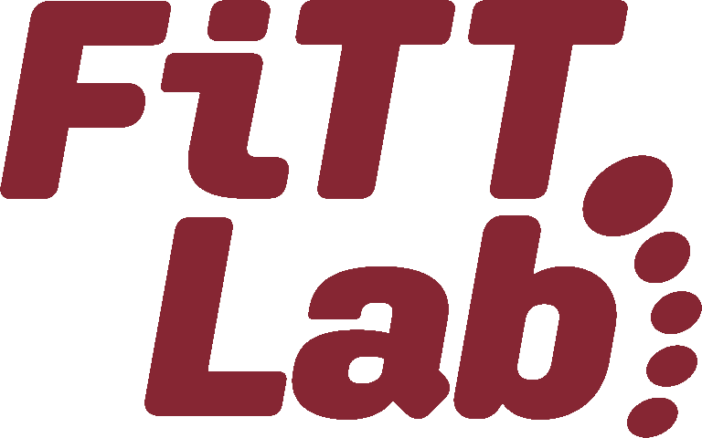
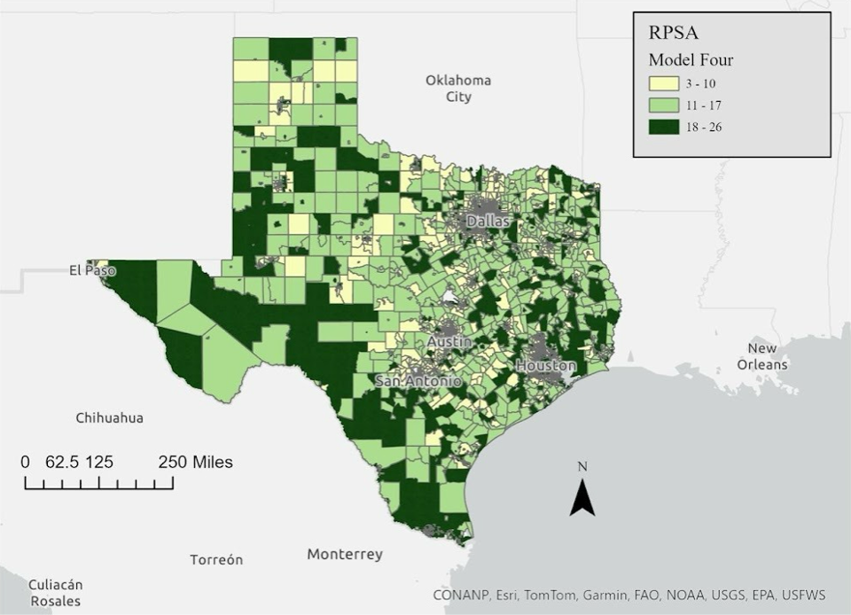

## Collaborations

```{=html}
<div style="display: flex; gap: 1.5rem;">
  <div style="flex: 1; border: 1px solid #dee2e6; border-radius: 8px; padding: 1.5rem;">
    
    <h3>FITT Lab</h3>
    <p>Dr. Erin Futrell's FITT Lab where I am an Analytics Consultant (yes, I wore the minimalist shoes and yes, I still do my "toe yoga").</p>
    <a href="https://gulick.springfield.edu/fitt/"target="_blank">Foot Intrinsic Testing and Training Lab</a>
  </div>
  <div style="flex: 1; border: 1px solid #dee2e6; border-radius: 8px; padding: 1.5rem;">
    
    <h3>Rehab Maps Research Lab</h3>
    <p>Dr. Madeline Ratoza's Rehab Maps Research Lab — research on access and equity in physical therapy services using layered maps.</p>
    <a href="https://www.madelineratoza.com/rehab-maps-research-lab"target="_blank">Rehab Maps Research Lab</a>
  </div>
</div>
```

------------------------------------------------------------------------

## Other Projects

### Arthritis Care Model

This is part of the work I am doing with NACDD.

### Informatics and Data Standardization
